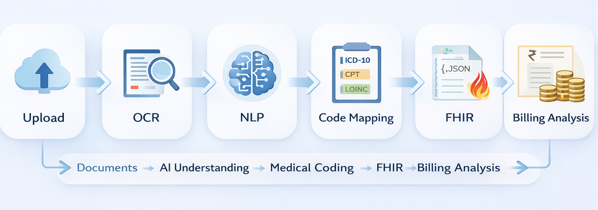
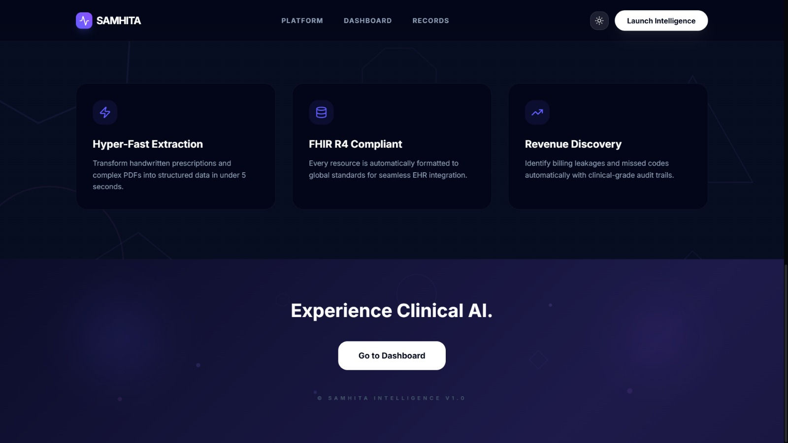
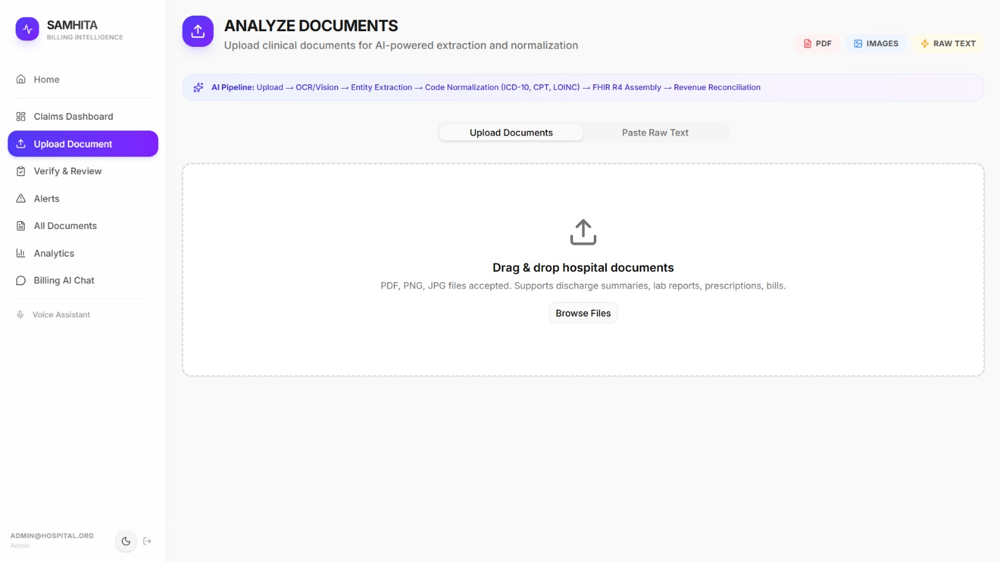
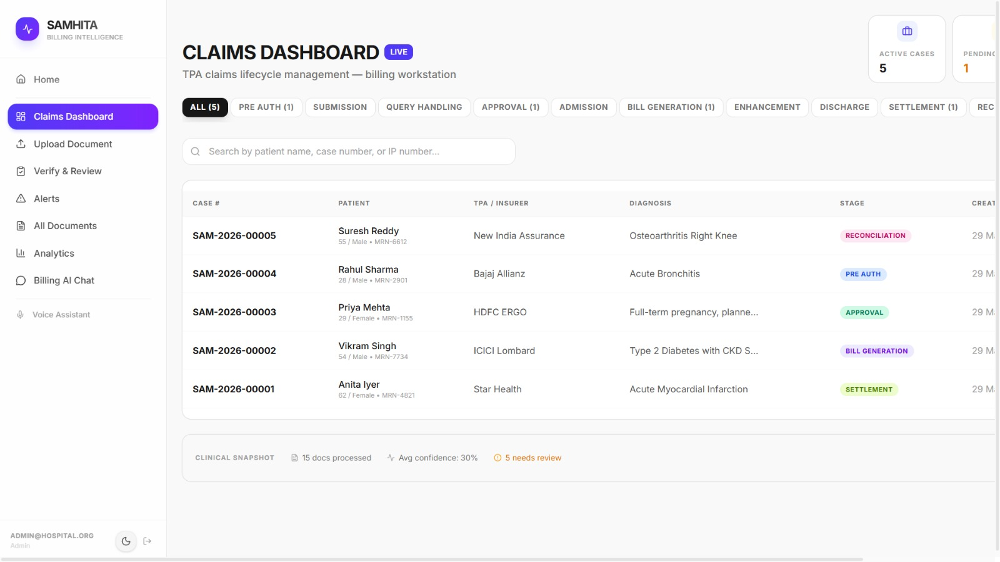
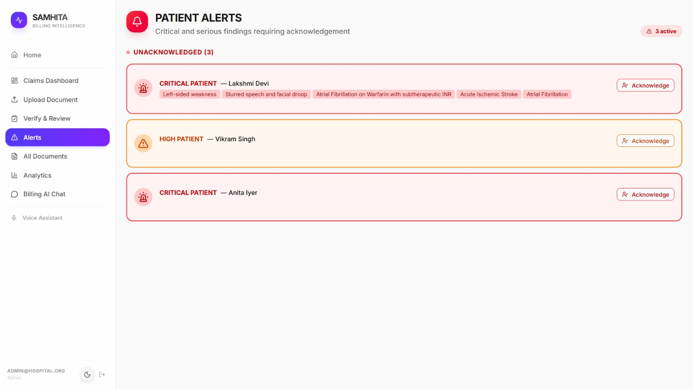
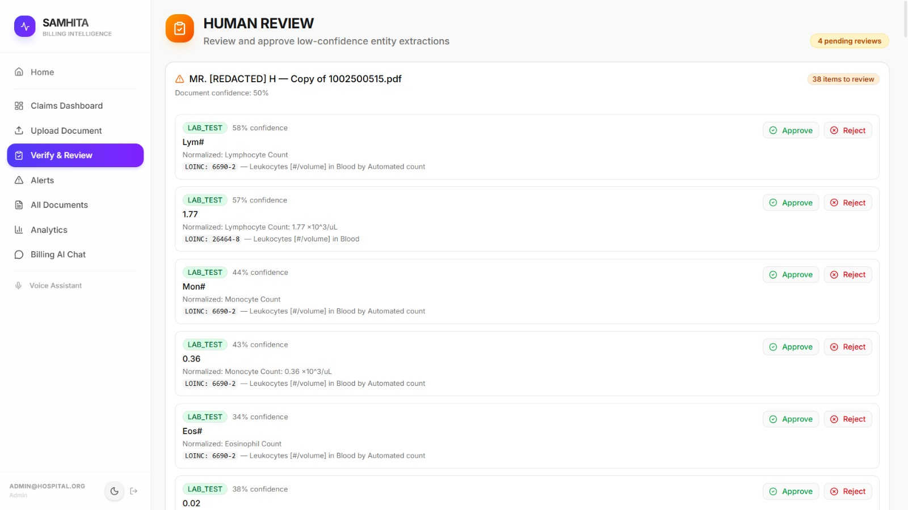
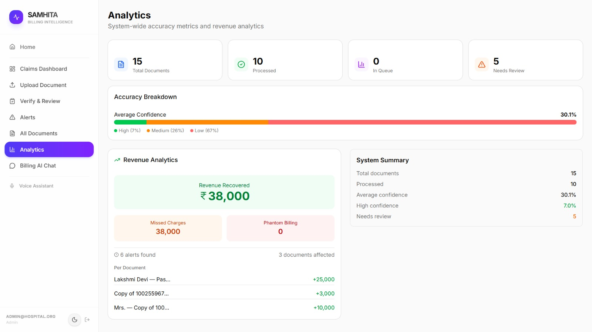
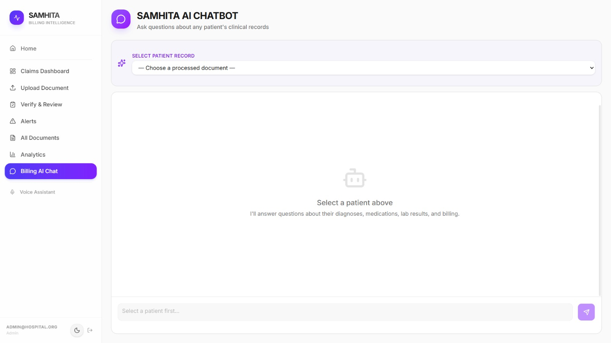
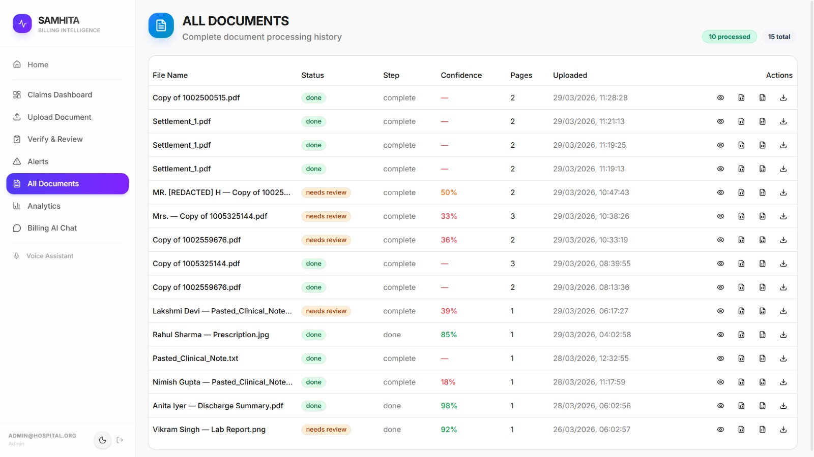
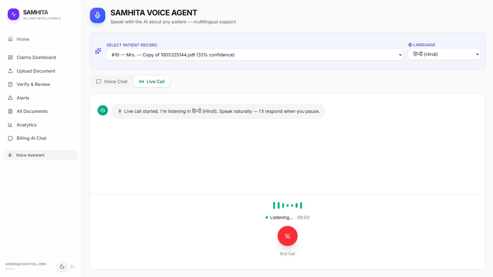

# 🏥 SAMHITA  
### _Clinical Intelligence Layer for Healthcare & Insurance Workflows_
   “From messy medical documents to claim-ready intelligence — in seconds.”

---

## 🚀 Overview

**SAMHITA** is an AI-powered system that converts unstructured medical data (handwritten prescriptions, PDFs, reports) into structured, coded, and claim-ready clinical intelligence.

It acts as an intelligent layer within hospital workflows, enabling:

⚡ Faster insurance claim processing
🎯 Accurate medical coding
💰 Reduced revenue leakage

---

## 🧠 Problem Statement

In hospital insurance workflows (RCM – Revenue Cycle Management):

- Clinical data is unstructured (PDFs, handwriting)  
- Coding is manual and error-prone  

This leads to:

❌ Claim rejections  
❌ Revenue loss  
❌ Operational delays  

---

## 💡 Solution

SAMHITA automates the most complex part of the workflow:

<p align="center">
  
</p>

---

## ⚙️ Key Features

### 📥 Intelligent Document Ingestion
- Supports PDFs, images, handwritten notes  
- AI-based OCR using Vision models  

---

### 🧠 Clinical Understanding
- Context-aware NLP  
- Extracts:
  - Diagnoses  
  - Procedures  
  - Medications  
  - Lab values  
- Handles abbreviations and negations  

---

### 🔎 Medical Code Mapping
- ICD (diagnosis)  
- CPT (procedures)  
- LOINC (lab tests)  
- Uses embeddings + FAISS similarity search  
- Ensures no hallucinated codes  

---

### 🏥 FHIR Standardization
- Generates FHIR R4 compliant JSON  
- Enables interoperability  
- ABDM-ready  

---

### 💰 Billing Intelligence
- Detects:
  - Missed charges  
  - Duplicate billing  
  - Unsupported procedures  
- Improves hospital revenue  

---

### 💬 AI Assistant
- Chatbot for patient-specific queries  
- Voice assistant (multi-language support)  

---

## 🧩 System Architecture

<p align="center">
  
</p>

---

## 🛠️ Tech Stack

| Layer | Technology |
|------|----------|
| Frontend | Next.js |
| Backend | FastAPI |
| Database | Supabase (PostgreSQL) |
| OCR | Vision AI |
| NLP | LLM (Llama) |
| Embeddings | Sentence Transformers |
| Vector Search | FAISS |
| Voice | Speech APIs |

---

## 🔗 Healthcare Standards Used

- ICD-10 → Diagnosis coding  
- CPT → Procedure coding  
- LOINC → Lab tests  
- FHIR R4 → Data interoperability  
- ABDM → Indian healthcare compliance  

---

## 🔗 Integration with Hospital Workflow (RCM)

### ✅ Current Capabilities

- Pre-authorization data preparation  
- Pre-authorization automation  

- Admission workflow integration  

- Treatment data processing  

- Enhancement detection  
- Enhancement request automation  

- Discharge summary processing  
- Automated discharge claim preparation  

- Billing and coding automation  
- Claim-ready output generation  

- Real-time insurer (TPA) integration  
- Approval validation and support  

- Settlement tracking (UTR, TDS)  
- Payment and financial reconciliation  

---

## 🚀 Advanced Capabilities

- End-to-end Revenue Cycle Management (RCM) automation  
- Intelligent billing validation and revenue leakage detection  
- Real-time claim processing pipeline  
- FHIR-compliant structured output (ABDM-ready)  

---

## 🔮 Future Scope

- SNOMED integration for deeper clinical reasoning  
- Multi-hospital and multi-insurer scalability  
- Predictive analytics for claim approval and risk scoring  
- Population health insights and research integration

---

## 📊 Impact

- Reduced claim denials  
- Increased hospital revenue  
- Faster processing  
- Structured, interoperable data  

---

## ⚠️ Limitations

- Depends on external APIs  
- No offline mode (currently)  
- Limited code database  
- Multi-page latency (~20s)  
- Single-user prototype  

---

## 🧠 Key Insight

> SAMHITA does not replace hospital systems —  
> it enhances them by automating the most error-prone step:  
> converting unstructured clinical data into standardized, claim-ready intelligence.

---

## 📦 Installation

```bash
git clone https://github.com/your-username/samhita
cd samhita
```

## Backend
```bash
cd samhita-backend
uvicorn main:app --reload
```

## Frontend
```bash
cd samhita-ui
npm install
npm run dev
```

## 🤝 Contributors
- Aryan Pandey
- Gangotri Gupta
- Nimish Gupta

## 📸 Demo / Screenshots

<p align="center">
  
</p>
<p align="center">
  
</p>
<p align="center">
  
</p>
<p align="center">
  
</p>
<p align="center">
  
</p>
<p align="center">
  
</p>
<p align="center">
  
</p>
<p align="center">
  
</p>
<p align="center">
  
</p>
<p align="center">
  
</p>


---
